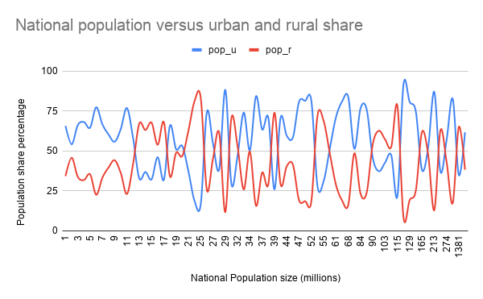
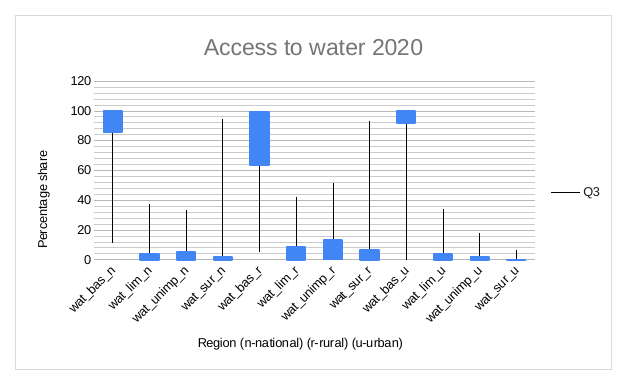
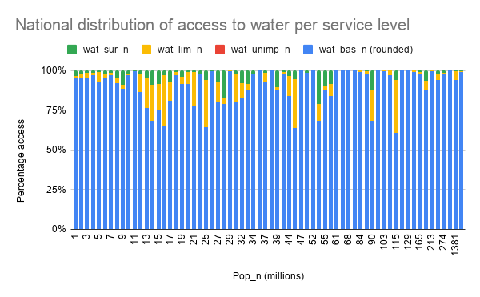
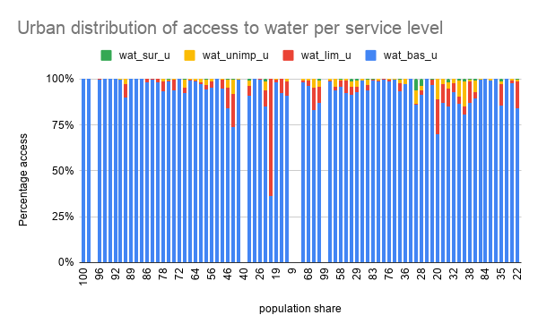
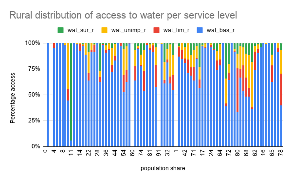
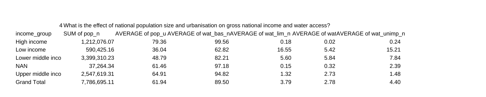

# Part 1: Distribution & Predictors of Water Access

## Aim

Investigate access to safe and affordable drinking water, focusing on
service levels between different countries and regions.

## Questions

1. How do the world population estimates compare to the provided dataset?
2. How does urban population share compare to rural?
3. What is the tendency and spread of the different access features?
4. What is the effect of national population size and urbanization on
   water access?

## Data

Cross-sectional, country-level estimates of population and water-service
coverage, split into four service tiers: **basic**, **limited**,
**unimproved**, and **surface** water, each reported nationally, and by
urban/rural population.

| Field | Description |
|---|---|
| `income_group` | World Bank income classification |
| `pop_n` | National population size estimate (thousands) |
| `pop_u` / `pop_r` | Urban / rural population share (%) |
| `wat_bas_n/u/r` | Share with at least basic service (%) |
| `wat_lim_n/u/r` | Share with limited service (%) |
| `wat_unimp_n/u/r` | Share with unimproved service (%) |
| `wat_sur_n/u/r` | Share relying on surface water (%) |

Source file: [`data_water_distribution_pt1.xlsx`](data_water_distribution_pt1.xlsx)

## Findings

### 1. The dataset is representative at a global scale

Summed national population estimates come to ~7.79 billion against a
theoretical world population of ~7.82 billion, a difference of only
**0.44%**. This is a reliable basis for global-level conclusions.

### 2. Urban population share leads rural, but not universally

Globally, **56% of the population is urban vs. 44% rural**, though this
varies widely by country, some countries are overwhelmingly rural,
others overwhelmingly urban.



### 3. Basic access is left-skewed; rural access is the most unequal

Across all three population groups, the mean sits below the mode (100),
meaning most countries have full or near-full access, but a smaller
group with much lower access pulls the average down:

- National: mean 89.5 vs. mode 100
- Rural: mean 80.1 vs. mode 100
- Urban: mean 92.8 vs. mode 100

**Rural basic access has by far the widest spread** (IQR 35.8, minimum
5.2) compared to urban (IQR 8.1, Q1 of 91.8), urban areas are
consistently close to full access worldwide, while rural access varies
enormously by country. Limited, unimproved, and surface-water access are
all right-skewed with a mode of 0: most countries report close to none of
their population using these poorer service levels, but a smaller group
reaches much higher shares, up to 51% for unimproved rural access and
94% for national surface-water use.



Per-country detail behind that summary, split by service level:





### 4. Income group is the strongest predictor of water access

Population size and urbanization show **no clear relationship** with
water access. Income group is by far the strongest predictor:
high-income countries average near 100% basic access, while low-income
countries average about 65%, with far higher shares of limited,
unimproved, and surface-water use.



## Method

All cleaning, pivoting, and analysis was done in Excel/Google Sheets.
The workbook's `Overview`, ` Report`, and `Pivot Table 1` sheets have
the underlying formulas and pivot tables. Every image in this folder is
a direct screenshot of that workbook. Charts 02 to 06 are native Sheets
charts. Chart 07 is the pivot table itself, since its native chart
didn't render correctly when exported, so the underlying table is shown
instead.

## Repository structure

```
├── README.md
├── data_water_distribution_pt1.xlsx    # source data + underlying workbook analysis
└── charts/
    ├── 02_urban_rural_population_share.png
    ├── 03_feature_spread_boxplot.png
    ├── 04_national_service_distribution.png
    ├── 05_urban_service_distribution.png
    ├── 06_rural_service_distribution.png
    └── 07_income_group_pivot_table.png
```
