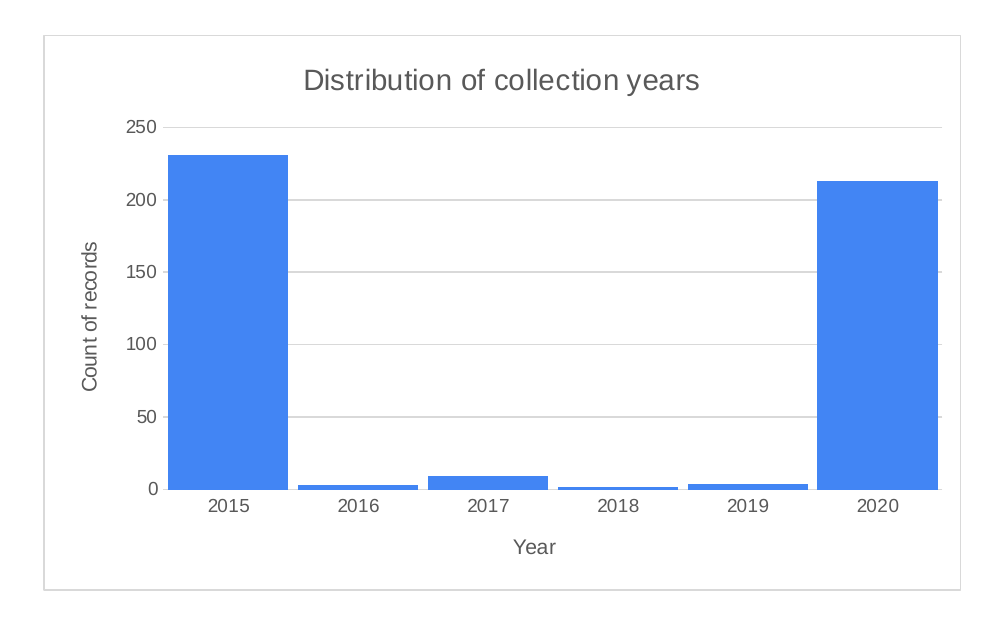
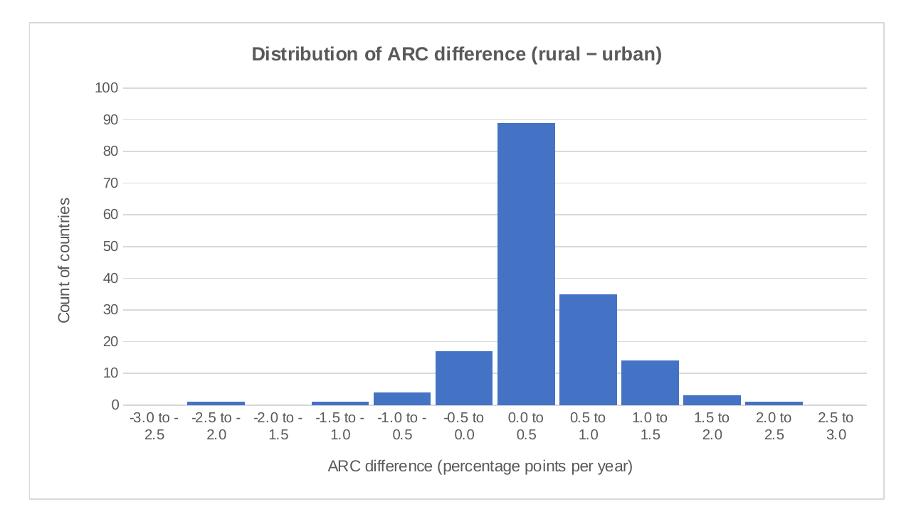
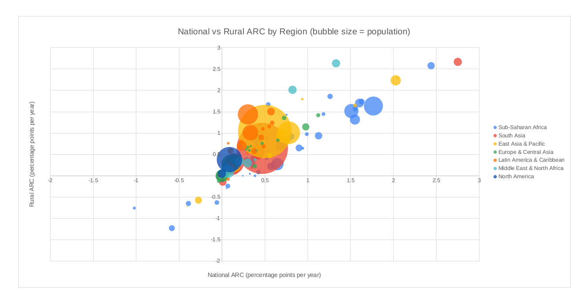

# Part 2: Rate of Change in Water Access (2000–2020)

## Aim

Investigate access to safe and affordable drinking water, and how the
rate of improvement differs across countries, rural/urban populations,
and regions.

## Questions

1. How frequently was water access data collected across countries?
2. How does the annual rate of change (ARC) in water access differ between
   rural and urban populations?
3. How does the rate of change in water access vary across regions and
   population sizes?

## Data

The dataset covers 165 countries with estimates of the share of the
population with access to at least a basic water service, broken down by
national, urban, and rural populations, for the years 2015 and 2020.

| Field | Description |
|---|---|
| `pop_n` | National population size estimate (thousands) |
| `pop_u` / `pop_r` | Urban / rural population share (%) |
| `ARC_n` / `ARC_u` / `ARC_r` | Annual rate of change in water access, national / urban / rural (percentage points/year) |
| `wat_bas_n/u/r` | Share of people with at least basic water service (%) |
| `wat_unimp_n/u/r` | Share of people with unimproved service (%) |
| `wat_sur_n/u/r` | Share of people relying on surface water (%) |

Source file: [`data_water_access_2000-2020.xlsx`](data_water_access_2000-2020.xlsx)

## Findings

### 1. Data collection was uneven across years

Most countries reported data in 2015 and 2020 (231 and 213 records
respectively), with only a handful of records in the years between. The
average gap between a country's two collection points was 4.8 years, with
most countries reporting a full 5-year gap. Because collection periods
differ slightly between countries, comparing raw changes in access isn't
fair, this is why the analysis uses an **annualized** rate of change
(ARC) throughout.



### 2. Rural water access improved faster than urban access

Across the 165 countries, rural access improved at an average of **0.48
percentage points per year**, more than three times the urban average of
**0.15 pp/year**. This mostly reflects rural areas starting from a much
lower base, there was simply more room to improve. The distribution below
shows the gap (rural ARC − urban ARC) per country: the large majority of
countries sit on the positive side, meaning rural access is catching up to
urban access in most of the world.



### 3. Regional gains vary sharply, and rural gains usually lead

Sub-Saharan Africa improved fastest overall, at **0.56 pp/year**
nationally, while Europe & Central Asia and North America barely moved
(0.11 and 0.02 pp/year). This isn't a sign of poor performance in the
latter regions, they were already close to full access, so there was
little room left to gain. In every region except North America, the rural
rate of improvement (y-axis) exceeds the national rate (x-axis), shown by
how far each bubble sits above the dashed reference line.



## Method

All cleaning and aggregation was done in Excel (see `Summary Sheet` and
`Regions` tabs in the workbook for the underlying formulas and pivot
calculations). All three charts below are direct exports of the native
charts built in that workbook.

## Repository structure

```
├── README.md
├── data_water_access_2000-2020.xlsx   # source data + underlying workbook analysis
└── charts/
    ├── 01_collection_years.png
    ├── 02_arc_diff_distribution.png
    └── 03_arc_by_region_bubble.png
```
